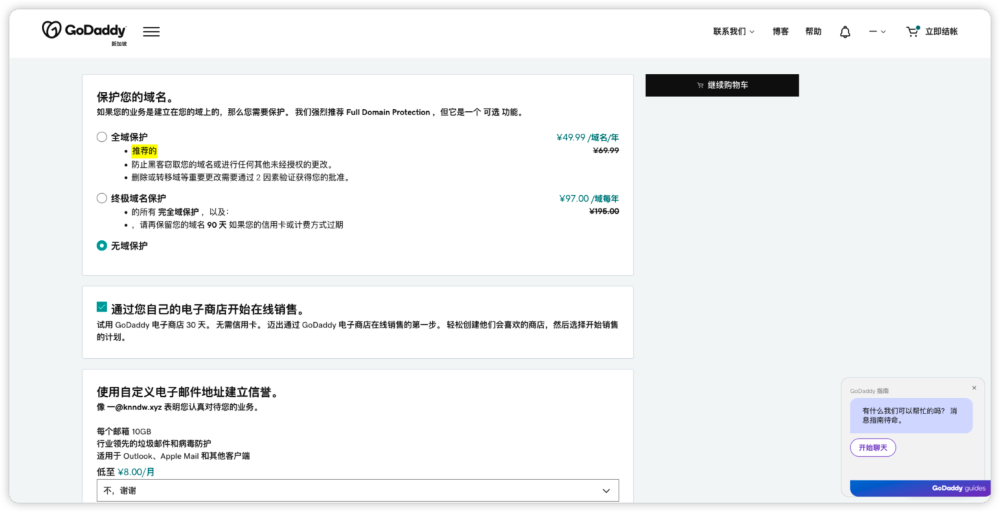
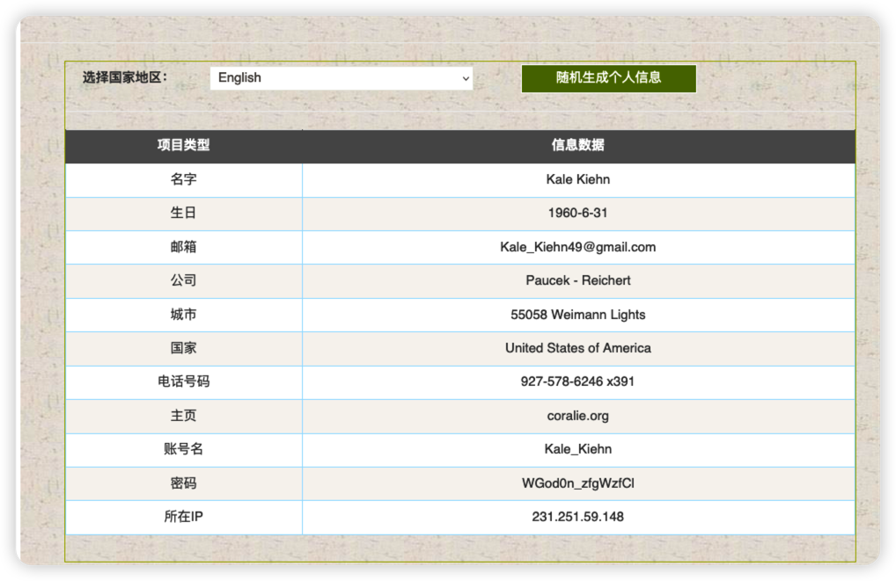
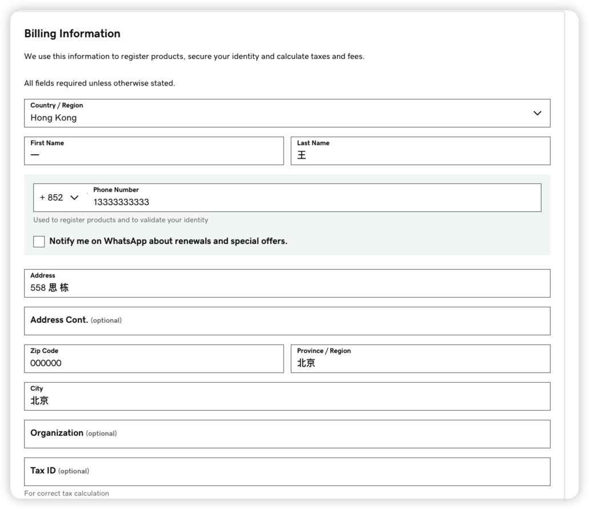
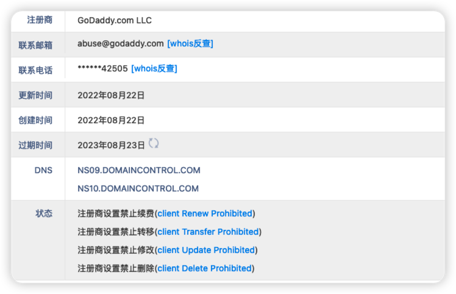
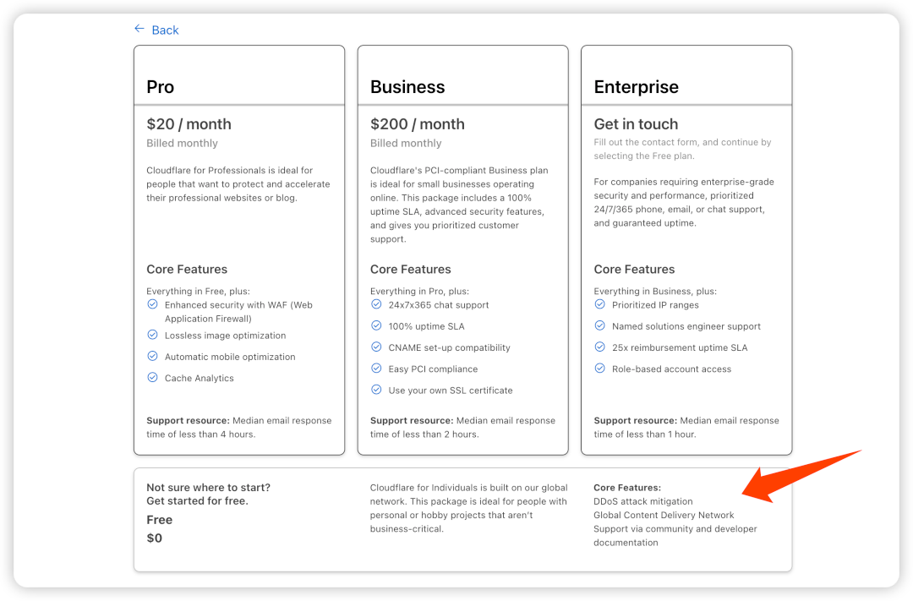
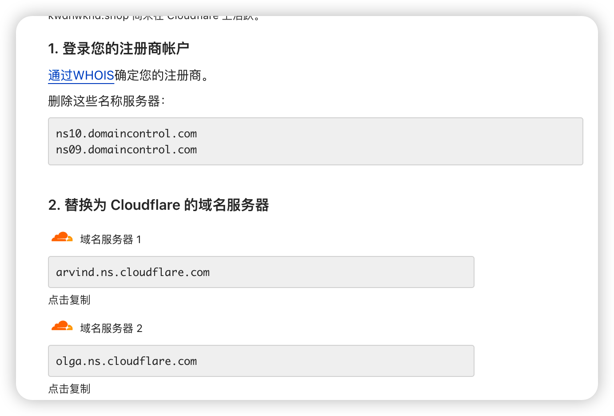
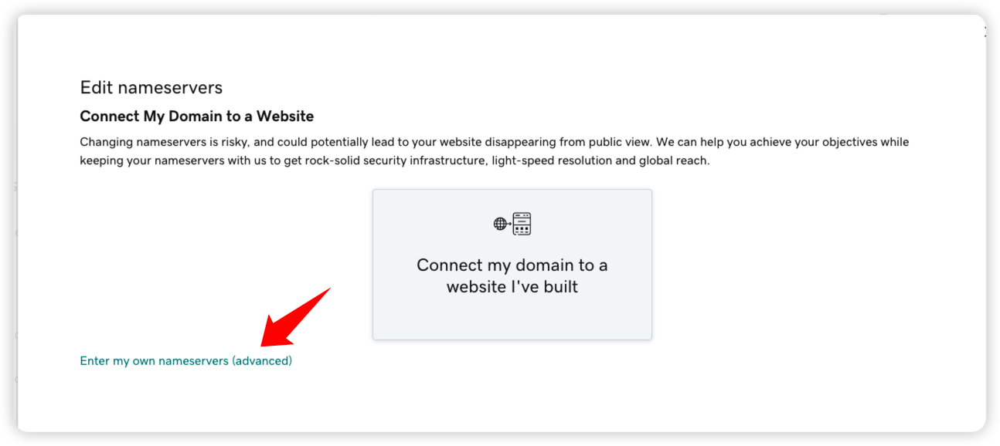
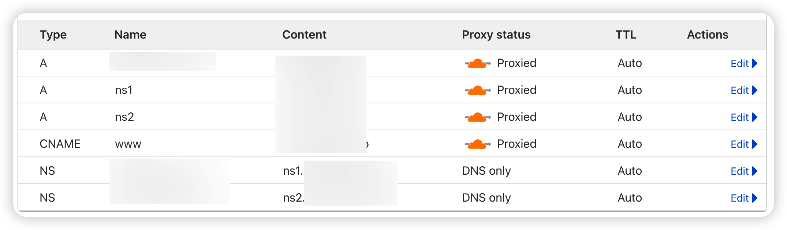

# 关于Antenna 的隐匿性部署

## 前言

Antenna项目:[https://github.com/wuba/Antenna](https://github.com/wuba/Antenna)

使用文档:[http://blog.antenna.cool/docs/intro](http://blog.antenna.cool/docs/intro)

Antenna当前已经提供了白帽子经常用到的DNS/HTTP等协议的监听能力，其中关于DNSLOG功能的支持虽是老生常谈但还是有一些细节想拿出来唠叨一下的。

## 为什么要有自己的DNSLOG

其实这个问题应该换成为什么不用公开的DNSLOG服务更恰当，白帽子使用DNSLOG的核心需求是通过其请求日志判断自己
的目标是否存在漏洞，公用的DNSLOG无论上从便捷性还是可溯源性上来看确实是白帽子使用的首选
，但是在作者看来，有些白帽子没有挖掘到漏洞的原因可能正是用了公用的DNSLOG服务。
在具有安全建设能力的企业内，已经早早地通过DNS污染或者反制等方法对这些域名加上了黑名单策略
常见DNS服务域名

```text

".dnslog.cn",
".ceye.io",
".burpcollaborator.net",
".interact.sh",
".dnslog.link",
".imgcdnns.com",
".ns.dns3.cf",
".tu4.org",
".dnslog.cool",
".yunzhanghu.co",
".1433.eu.org",
".dnslog.run",
".dnslog.io",
".s0x.cn",
".awvsscan119.autoverify.cn",
".360-cert.com",
".interactsh.com",
".microcoft.cyou",
".mauu.me",
".oast.me",
".oastify.com",
".oast.fun",
".0x557.wang",
".cybertunnel.run"

```

所以当你看到自己的dns请求日志上空空如也或者请求多得让你喘不过来气(反制策略)
的时候，你可能真的需要考虑搭建一个自己的拥有DNSLOG能力的平台了(强烈暗示)
## DNSLOG为什么需要隐匿

因为溯源，你要知道你的所有DNS请求行为在目标方看来都是具有入侵性质的，虽然域名已经暴露了，但是你要尽可能地做到暴露的信息真的只有一个域名。那么接下来我们就可以看一下有哪些可以帮助我们匿名的方法。

## 隐匿方法
### 域名信息隐藏-Godaddy 域名购买
国内的域名注册都是需要实名认证的，所以这里推荐使用国外的Godaddy购买域名。
选择好域名添加购物车，不需要选择任何的附加的服务


点击继续购物车，然后选择购买年限，然后点击准备好付款，紧接着他需要填写购买者信息
这里我推荐使用匿名信息生成，因为他不需要验证信息真实性
使用 **http://tools.jb51.net/aideddesign/rnd_userinfo** 网站，选择一个国家立即生成


填写一些必要信息就好了


结账方式选择alipay(支付宝)，点击继续购买，这样域名就搞定了，去查询一下购买的域名的WHOIS，并不会出现个人信息


### 真实IP隐藏-Cloudflare替换DNS
cloudflare 是一家国外的 CDN 加速服务商，提供免费和付费的加速和网站保护服务。这样你的域名绑定解析的IP通过CDN也进行了完美的隐藏。
首先注册Cloudflare账号，进入首页，点击新增网站


选择免费服务



进入后可看到cloudflare会提供给你两个dns服务器



返回Godaddy，点开自己的域名进入DNS Management 界面，选择下方Nameservers 点击change然后选择输入个人的nameserver


将cloudflare提供的域名服务器输入进行并保存，接下来前往cloudflare按照正常A记录配置自己的域名以及ns域名，但是这里需要将你DNSLOG域名(自域名)配置NS记录指向ns域名


这样你的真实IP在解析过程中就会替换成cloudflare的IP，但是还是存在找到真实IP的方法的。加入溯源人员指定cloudflare的DNS服务器去进行DNS解析，其实还是会暴露。

### 资产与入口隐藏-路径设置
溯源人员免不了访问你的域名或尝试找到登录界面，关于Antenna的客户端与服务端分离部署在我们后面的文章进行讲解，如果你按照我们推荐的方式部署，不妨设置一下域名登录界面的路径
根据你的部署方式，打开docker-compose或者.env文件进行配置


这样只有访问特定的路径才会暴露你的登录界面，也就进一步避免了溯源人员发现Antenna的存在
结尾-关于域名污染
其实上述方法只是帮助自己尽可能减少被溯源的可能性，但是依旧避免不了目标的安全团队识别出你的域名在内部实行DNS污染，那有没有好的办法避免自己的域名被污染掉呢。目前来看是没有的，但是确实还是有一些其他的技巧可以给反入侵与溯源人员造成一定困扰的。这些技巧后续也会更新再Antenna的博客上.如果当前您对Antenna的使用遇到一些问题，欢迎大家提
交issue,或者进入交流群进行讨论。
如有问题或者一些建设性的想法想与技术同学沟通，请联系并添加微信号：bios_000


