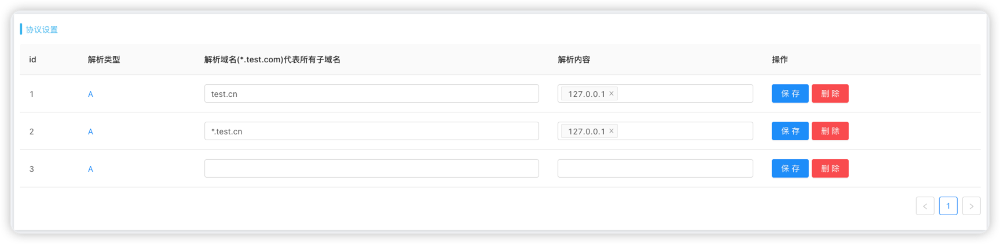
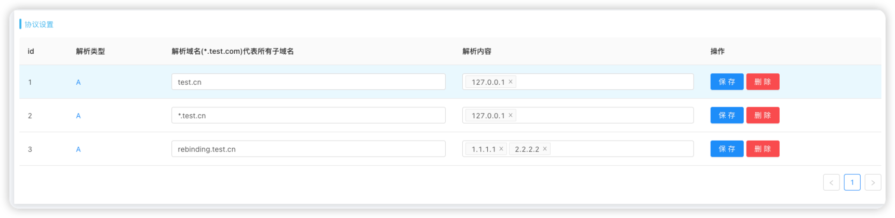
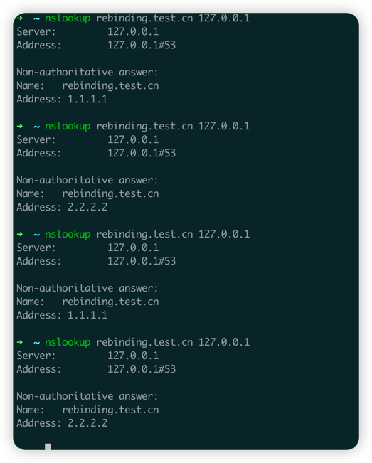

## Antenna v1.3.0 版本更新公告(含DNS REBINDING使用教程)

## 更新内容

1. 优化监听组件管理，将DNS等监听组件进程通过supervisor统一管理
2. 优化平台管理配置界面，新增**保存平台七天内请求消息**与**DNS解析配置**功能
3. 平台支持DNS_REBINDING能力(仅对平台管理员开放)

## 新版使用注意

1. v1.3.0 版本通过supervisor去管理各种协议监听的进程，所以选择源码部署新版本的同学需要查看
   /conf/antenna.ini文件中的 **directory**值是否为与实际项目地址一致，个人推荐将项目下载到
   根目录下
2. 旧版本更新至新版的同学需要重新按照.env.example文件进行填写并将其修改为.env文件。这是因为
   新版本新增加了一些配置项
3. (部署及安装教程)[http://blog.antenna.cool/docs/intro]已更新，如有相关问题可参考文档

## DNS_REBINDING 功能演示

Antenna 的系统设置-**平台管理**(管理员权限) 新增协议设置模块，在这里可以自定义
设置DNS监听组件的解析配置,当前只提供A记录配置管理(其他的记录如果有需求可以提到issue，作者
看情况增加)

在这里我们新增一条A记录 解析域名rebinding.test.cn 解析内容为*1.1.1.1*
与*2.2.2.2*，如下图配置

点击**保存**按钮,这里在本地演示需要指定解析DNS服务器地址(127.0.0.1)

作者通过代码将DNS应答的**TTL**设置成了0，当DNS的TTL设置为0时，它将永远不会被缓存，每次查询都会发送到DNS服务器。
所以可以稳定复现，同学们可以安心的尝试绕过各种安全策略。但这也意味着我们的DNS监听组件会受到更多的请求，
可能会影响服务的性能。

## 目前在做

1. 允许用户组件配置多种自定义格式链接
2. 制作Antenna python标准库

如果对Antenna有更多的需求以及各种想法，欢迎在issue上提交
