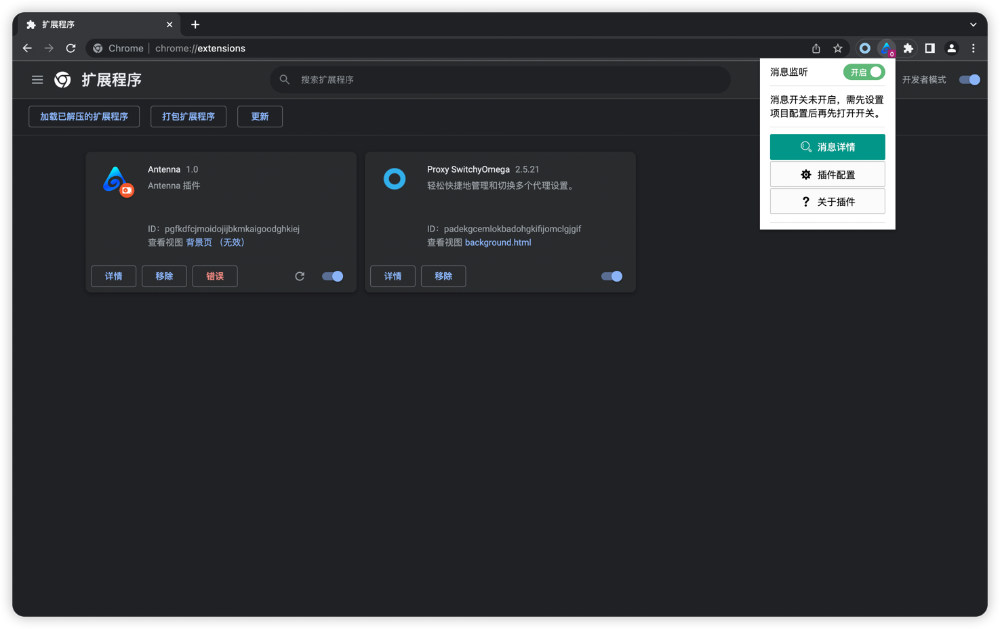

# antenna-tools 更方便的chrome扩展

## 前言-如何让Antenna向"好的产品"靠近

Antenna项目:[https://github.com/wuba/Antenna](https://github.com/wuba/Antenna)

使用文档:[http://blog.antenna.cool/docs/intro](http://blog.antenna.cool/docs/intro)

"什么样的产品才算是一款好的产品？"以及"如何让Antenna成为一款好的产品?"这是作者一直在想的问题，经过不断地学习和调研，
作者认为，一款好的产品，必须满足以下几个特点：
* 解决用户的需求
* 良好的用户体验
* 有黏性
* 平衡好商业模式和用户体验

第三点和第四点对于Antenna来说太过于抽象与遥远，所以不如目前把重心放在第一点和第二点上。
Antenna的核心需求一直都是以通过产品辅助用户验证各种漏洞的真实存在于可利用性。那
明确了需求我们便知道我们要努力优化的点在哪里

## 如何让用户在收到消息通知上拥有更好的体验

在Antenna开源后，我们一直在优化OPENAPI与CALLBACK两个消息通知依赖模块，我们也参考了其他的一些
工具与产品，通知方式无外乎邮件、微信、钉钉等,但是这些通知方式都需要用户需要打开**媒介**
去接受信息，或者更通俗的讲，用户都需要查看另一个界面,要知道此时的用户都在显示屏幕前面对着自己的目标
进行验证，让用户摆脱目标的界面去查看另一个界面。我们觉得这其实应该有优雅的解决方案。如何让用户在同一个
界面(不需要跳转页面)就能接收到消息？于是便有了antenna-tools的试用版本

## chrome-tools 使用教程

以前的antenna如果接收到消息或者使用利用链接，其实依旧需要用户跳转至系统界面去操作，我们认为这并不优雅，于是我们尝试
制作了基于Antenna个人APIKEY的chrome扩展，目前Antenna-tools只支持右键菜单点击复制利用payload以及监听消息请求
功能(自Antenna v1.1版本开始支持扩展，所以您需要将之前的Antenna进行更新)，接下来就让我们看看怎样来使用

### 安装 chrome-tools
首先下载或者更新Antenna至V1.1版本以上。保证您有一个可使用的Antenna系统后，并将Antenna项目下的plugin目录下载到本地。打开您的chrome浏览器，
在地址搜索栏输入**chrome://extensions/** 您会来到chrome扩展管理页面,并点击右键改为开发者模式

点击左上角**加载已解压的扩展程序** 选择加载您下载的plugin目录，这样就完成了Antenna扩展的安装，您可以在浏览器的右上角找到它

### 配置与payload的使用

点击antenna扩展后还需要您点击**插件配置**,进入配置页面

填写Antenna用户的个人apikey以及您的Antenna系统域名(tips:不需要输入您配置的隐藏登录界面的路径)

保存后来到您的扩展页面重新刷新插件(目前需刷新插件进行数据重写)
点击右键，查看是否已有payload菜单，后续如果你在Antenna更新payload也需
刷新插件(当前正在优化的地方)

点击您的payload，他便会保存到您的粘贴板上，使用的时候直接 **control + V**就轻轻松松使用

### 关于message监听

关于同界面接收到数据请求才是我们最想实现的功能，只需您打开插件的监听按钮，插件会每五秒监听一次最新消息
这样，就更加方便的接收消息，从而不会遗漏任何一个漏洞的触发。

## 问题解答
### 1、为啥安装会有错误显示
回答：当前chrome扩展由于manifest v2版本开发，所以会有一些兼容性的错误，目前测试并不影响功能实用，如出现不能正常使用的情况
请在issue留言

### 2、消息监听，插件徽章显示有新消息数，但没有通知提醒
回答：这可能是因为您的chrome没有开启notifications的权限
解决方案： 1、在Chrome浏览器中访问地址：chrome://flags。 2、搜索栏中搜索：notifications，找到 Enable system notifications 选项，
将其选项值改为 Disabled，重启浏览器就能正常使用

