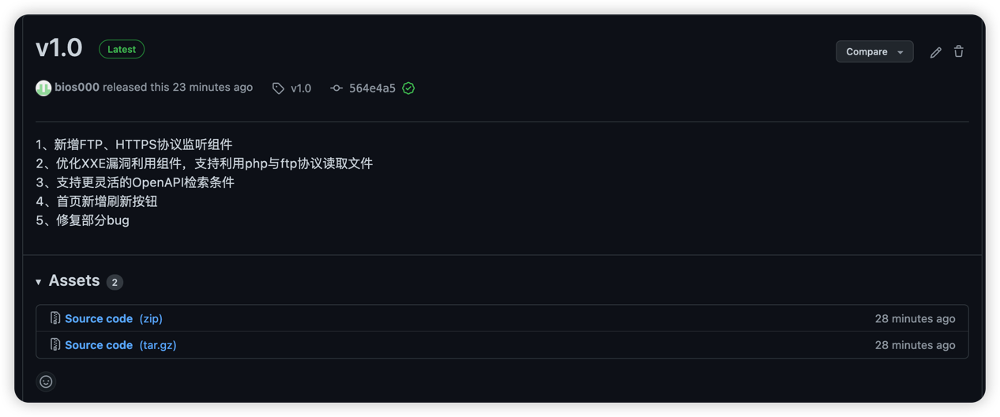
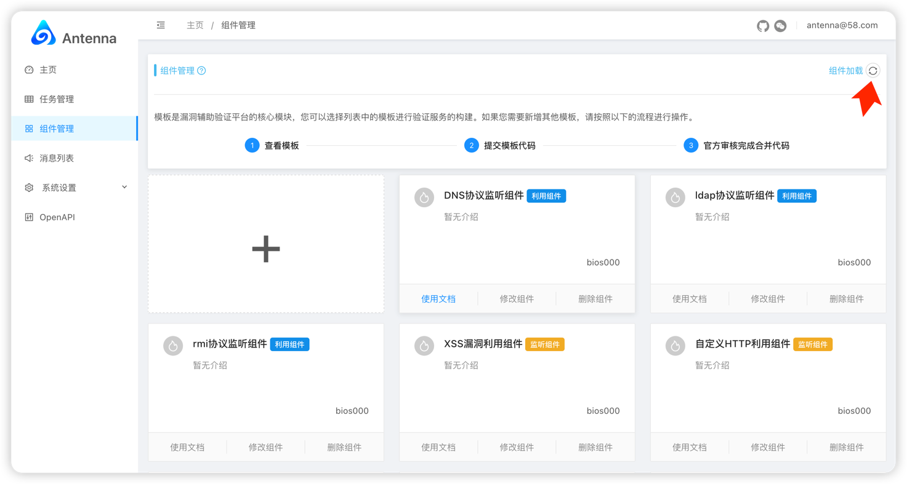
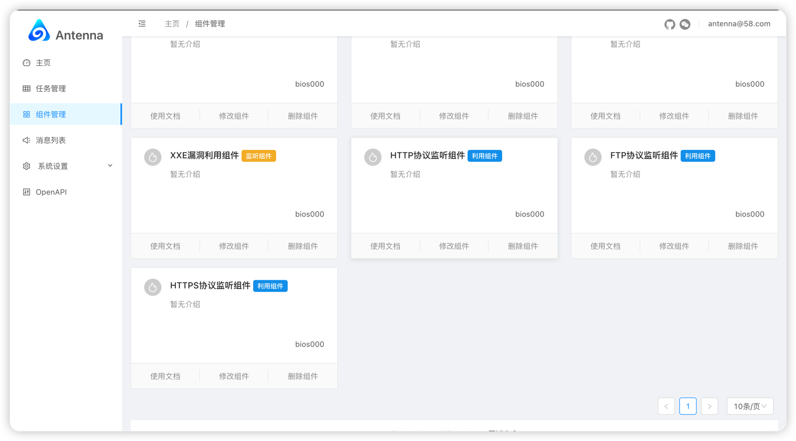
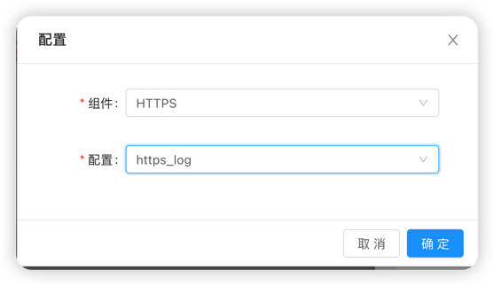
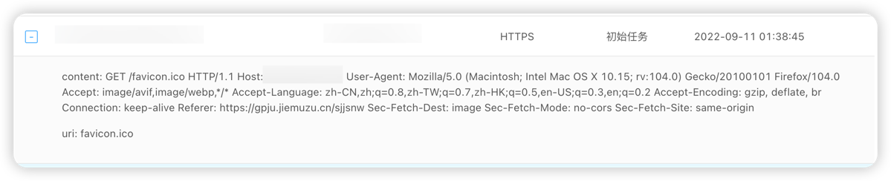
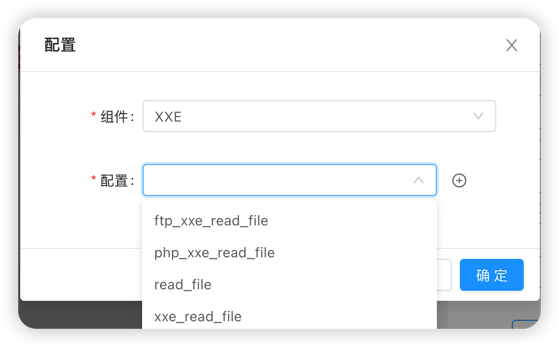

# Antenna V1.0 发布公告

## 前言

自Antenna在八月底开源后，我们收到用户非常多的反馈(当然也有很多的bug)，这种现象是我们非常希望看到的，我们希望用户能够参与到Antenna
的功能设计与发展工作中， 理所当然，我们满足了当前用户提出的部分需求并做了很多比较有意思的改动，于是v1.0版本发布了。**
发布公告阅读大概需要 5 minutes左右**

## 更新概要

这次**v1.0**的主要更新内容如下：

* 监听--新增FTP、HTTPS协议监听组件
* 利用--优化XXE漏洞利用组件，支持利用php与ftp协议读取文件
* OpenAPI--支持更灵活的OpenAPI检索条件
* 部署--增加前端的docker部署，实现本地连接远程server
* 下次更新的准备工作
  
  接下来就聊聊这段时间我们做了些什么

## 更新讲解

### 监听--新增FTP、HTTPS协议监听组件

我们收到了一些用户反馈，希望Antenna能够支持更多的协议请求监听能力，
Antenna针对于协议监听模块使用了著名的Twisted框架，他的能力强大到支持
用户可以轻松使用各种协议进行通信，作者当前已经实现TCP、UDP、SSL/TLS、HTTP、IMAP、
SSH、IRC以及FTP这些常见协议的监听，但是根据产品的核心需求与功能
我们在**v1.0** 只是增加FTP与HTTPS的监听能力，我们更希望您个人开发适合自己的组件，
所以我们目前在努力尝试抽象监听组件的自定义开发，预计将在下个**大版本**中
支持用户自定义监听组件

下载或者更新代码后，在组件管理页面点击**组件加载**，就能使用到最新的组件








### 利用--优化XXE漏洞利用组件，支持利用php与ftp协议读取文件

由于目标的开发语言以及语言版本都会对XXE漏洞利用读取文件有着重大的影响，
我们为了支持更多的场景增加了php协议与ftp协议读取文件并进行数据外带的使用



### OpenAPI--支持更灵活的OpenAPI检索条件

关于OpenAPI的优化是我们非常愿意做的事情，我们愿意为各种扫描工具做各种适配于兼容
并且增加越来越灵活的检索条件，目前Antenna的OpenAPI支持查询参数

| 参数           | 说明                                                                                                                                     |
|--------------|----------------------------------------------------------------------------------------------------------------------------------------|
| apikey       | 用户个人apikey                                                                                                                             |
| uri          | 请求路径，例如http://test.com/aaaa 的uri就是aaaa                                                                                                 |
| task__name   | 消息所属任务名，例如task__name=初始任务                                                                                                              |
| domain       | 请求域名。例如domain=111.test.com                                                                                                             |
| domain_in    | 多个域名查询，例如domain_in=[111.test.com,222.test.com]或者domain_in=["1111.test.com","222.test.com"]再或者domain_in=['111.test.com','222.test.com'] |
| message_type | 消息协议类型(1, "HTTP"),(2, "DNS"),(3, "LDAP"),(4, "RMI"),(5, "FTP"),(6, "MYSQL"),(7, "HTTPS")                                               |
| content      | 自定义的值(例如httplog里的message参数，ftplog里的登陆密码)                                                                                               |
| month        | 消息请求时间的月份 例如month=12                                                                                                                   |
| year         | 消息请求时间的年份 例如year=2022                                                                                                                  |
| page         | 分页数                                                                                                                                    |
| page_size    | 每页显示消息数量                                                                                                                               |

如果用户拥有更多需求，请留言在项目issue中

### 部署--增加前端的docker部署，实现本地连接远程server
我们设计的初衷是为用户使用更低成本部署系统，所以将静态资源编译好放入项目中
但是最近希望前端本地部署，后端sever在远程服务器的需求声越来越多，于是我们
将前端源码重新放入开源项目中，并提供了dockerfile 与docker-compose文件
用户进入项目**templates**目录，修改docker-compose.ym文件，填写您的antenna后端地址
执行**docker-compose up** 命令即可本地部署前端。

如果是源码部署只需要将**.env.example**的配置修改后，改名.env文件执行命令
```shell
yarn
yarn _prepare
yarn start
```
也可以进行访问
## Antenna_Inside计划

在我们开发Antenna时，就希望能够支持现有市场上流行的漏洞扫描工具漏洞结果回调与主动查询
所以我们推出了CallBack与OpenAPI，为了让我们的这两个模块能够更加灵活与优雅。我们决定发起
Antenna_Inside计划，希望能与使用扫描工具的用户或者作者联系我们，我们会无条件支持您的项目与
需求，帮助Antenna更方便的与漏洞扫描流程打通。

## 下次更新的准备工作

虽然我们已经发布了**v1.0** ，但是我们还是有一些功能并没有放入本次更新，但
我们也不会让用户等太久。 比如我们在内部讨论是否需要允许用户灵活自定义配置DNS解析
记录来实现**DNS-rebinding** ,我们也已经准备将MYSQL协议监听放到下次更新中。
我们认为平台消息显示的格式并不优雅，但由于我们的前端同学喜事将近，所以我们对很多前端的重构与更新
也放入了下一次版本更新，当然我们也推出了Antenna_Inside计划，希望Antenna能够更优雅更方便地帮助
各位用户满足安全场景。如果您对我们的Antenna项目感兴趣，或者您希望加入Antenna_Inside计划，请联系
作者，作者微信:bios_000
Antenna用户交流群：


