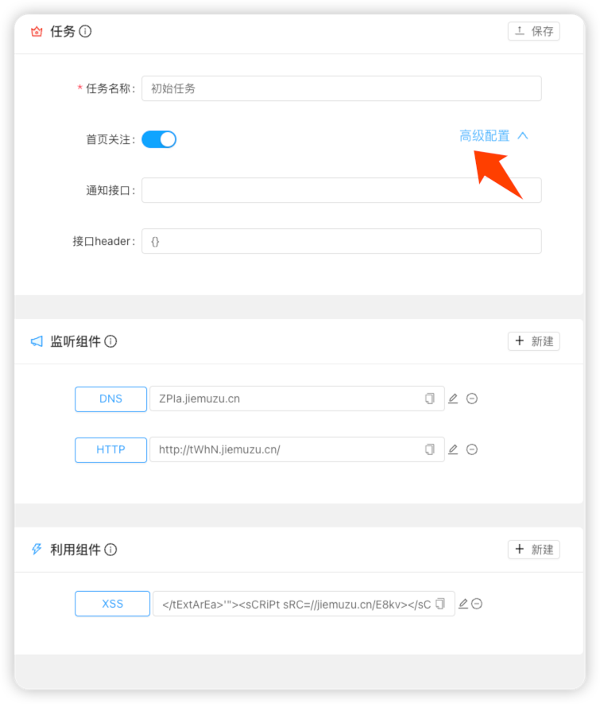

## 前言-关于OPenAPI与CallBack

Antenna是一款用于辅助用户验证漏洞结果准确性以及可利用性的漏洞，我们目前并没有提供
任何扫描能力的打算，但是我们对于Antenna和其他扫描工具进行能力打通的工作非常感兴趣。

由于大部分扫描工具利用Out-Of-Bind的方式将结果以及数据通过这种协议对外界接受服务进行请求
Antenna的能力目前已经能满足各种协议的请求记录，但是很显然，怎样更方便地通知到用户接受到请求消息
是我们现在更加关注解决的事情，于是对于请求消息的处理我们提供了OpenAPI与Callback两种模式

### OpenAPI

关于自动化漏洞工具，一般都会选择主动查询平台是否收到消息记录，于是我们的Antenna关于消息提供
OpenAPI,每个用户注册后都会生成个人apikey,API查询需要提供个人apikey。接下来我们看一下
OpenAPI的每个参数含义以及返回数据说明

#### OpenAPI 参数

关于OpenAPI的优化是我们非常愿意做的事情，我们愿意为各种扫描工具做各种适配于兼容
并且增加越来越灵活的检索条件，目前Antenna的OpenAPI支持查询参数

| 参数           | 说明                                                                                                                                     |
|--------------|----------------------------------------------------------------------------------------------------------------------------------------|
| apikey       | 用户个人apikey                                                                                                                             |
| uri          | 请求路径，例如http://test.com/aaaa 的uri就是aaaa                                                                                                 |
| task__name   | 消息所属任务名，例如task__name=初始任务                                                                                                              |
| domain       | 请求域名。例如domain=111.test.com                                                                                                             |
| domain_in    | 多个域名查询，例如domain_in=[111.test.com,222.test.com]或者domain_in=["1111.test.com","222.test.com"]再或者domain_in=['111.test.com','222.test.com'] |
| message_type | 消息协议类型(1, "HTTP"),(2, "DNS"),(3, "LDAP"),(4, "RMI"),(5, "FTP"),(6, "MYSQL"),(7, "HTTPS")                                               |
| content      | 自定义的值(例如httplog里的message参数，ftplog里的登陆密码)                                                                                               |
| month        | 消息请求时间的月份 例如month=12                                                                                                                   |
| year         | 消息请求时间的年份 例如year=2022                                                                                                                  |
| page         | 分页数                                                                                                                                    |
| page_size    | 每页显示消息数量                                                                                                                               |
| message_id   | 消息id                                                                                                                                   |

如果用户拥有更多需求，请留言在项目issue中

#### 返回数据说明

```json
{ "id":1,    //消息id
  "task_name":"初始任务",   //消息所属任务名
  "domain":"111。test.cn",   //请求域名
  "remote_addr":"1.1.1.1",   //消息远程地址
  "uri":null,   // 请求路径
  "header":null,  //请求header
  "content":null,   //自定义请求消息
  "message_type":2,   // 请求消息类型，消息类型可参照上文检索参数说明
  "create_time":"2022-09-08T11:10:37.248518",  //请求事件
  "template":8,   //组件id
  "task":1}     //任务id
```


### Callback

针对于一般的扫描工具，我们可以提供OpenAPI允许逻辑实现主动查询，但是如果您拥有工程化的扫描器或者大型扫描设备
无论是定时任务还是轮询的方式我们都觉得不够优雅，于是我们也提供了 **Callback(回调)** 的方式，只需要用户提供
接受消息的接口，antenna在接收到消息请求后，主动将消息结果发送到指定的接口

#### Callback使用方法

平台除了设置消息邮件通知以外，支持接收到消息后，向自定义接口发送消息数据，方便自动化工具回调接口处理请求消息 点击任务查看任务详情，打开任务高级配置


填写接受消息的接口 例如 **http://test.com/get_message** 如接口需要Authorization等认证方式可写在接口header中，例如 **{"Authorization": "admin"}** 平台接收到该任务的消息后会向**test.com/get_message**
发送接收到的请求消息数据