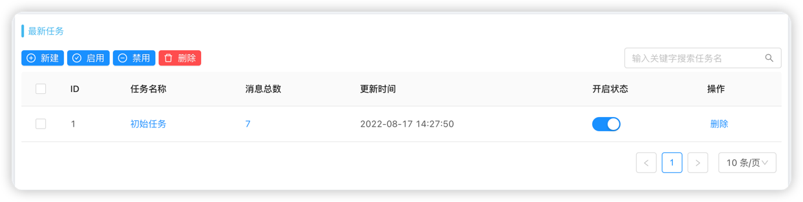
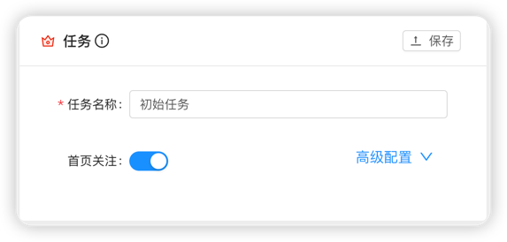
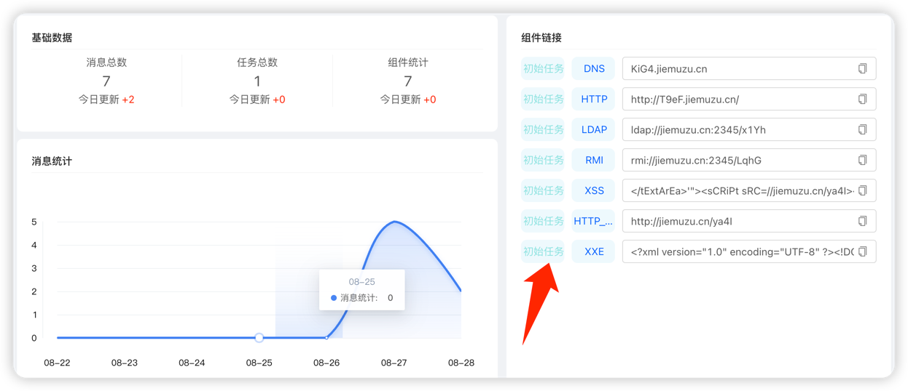
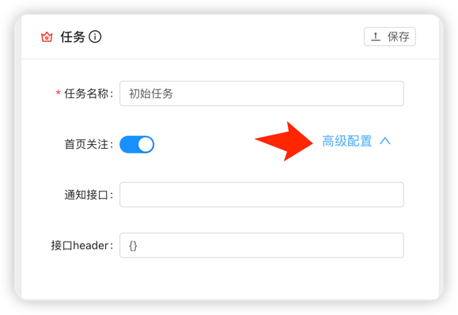

# 如何简单地使用任务(Task)

Antenna系统对于安全的各种能力实例都是通过任务的形式进行统一配置
了解所有的任务模块细节后相信对你的使用会有很大的帮助 **本文阅读大概需要 5 minutes左右**.

### 任务的状态

用户在部署Antenna时，系统默认会为管理员账户创建一个初始任务，并且会为用户提前准备好提一些基础的组件实例(链接)，
在用户点击左侧导航栏的任务管理，会跳转到任务管理页面，你会首先看到任务的一些基础状态。



其中**开启状态**决定了任务模块中组件实例的有效性，一旦你选择关闭任务的开启状态，这些组件的链接将会失效，不能使用

### 任务详情

点击任务名称，你会获取该任务的详细配置信息


### 首页关注

如果你对该任务下的组件链接经常使用，我建议你打开该任务的**首页关注** 这样你就可以直接在首页获取到该任务的
所有链接详情，减少你鼠标的点击次数是我们很愿意做的事情


### 任务高级配置
##### 自定义消息通知接口
平台除了设置消息邮件通知以外，支持接收到消息后，向自定义接口发送消息数据，方便自动化工具回调接口处理请求消息
点击任务查看任务详情，打开任务高级配置


填写接受消息的接口 例如
`http://test.com/get_message`
如接口需要Authorization等认证方式可写在接口header中，例如
`{"Authorization": "admin"}`
平台接收到该任务的消息后会向test.com/get_message发送接收到的请求消息数据
结构如下

```json
{
  "domain": "test.com/aaaa",
  "remote_addr": "1.1.1.1",
  "uri": "aaaa",
  "header": "{}",
  "message_type": 1,
  "content": "antenna is a cool"
}
```

