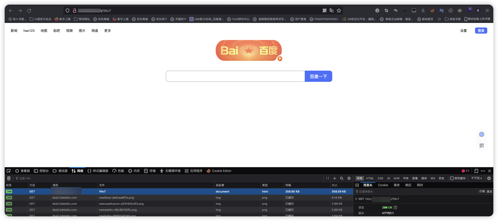
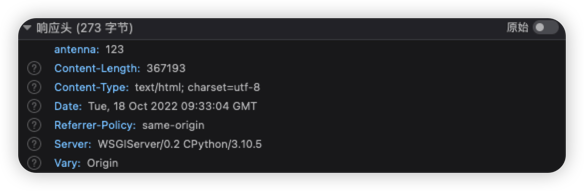

# 自定义http组件使用指南

## 前言
我们提供了基础的http与https监听组件，但是用户们在日常安全测试中会遇到
各种奇怪的漏洞场景，用户的需求就从可以接收http/https请求升级到了
在接收请求的基础上对请求进行处理甚至是需要修改请求的响应内容，于是自定义
http组件就出现了并支持了基础的jsonp_html、custom_http_location和custom_http_html三个功能

## 自定义响应内容-custom_http_html
Antenna在命中请求关键字后默认返回空响应值,但是总会有一些场景需要请求返回特定的
响应内容以及响应header，点击任务详情中利用组件的新建按钮，选择HTTP_CUSTOM组件
配置选择custom_http_html


此时你会发现存在两个额外的配置框需要填写，
value是你自定义的响应内容，一般为html源码。headers为你自定义的header头(注意，这里的headers需要写成json格式！！！)

自定义http组件对这部分的处理逻辑也非常简单,你可以在**组件管理-编辑组件**查看对应的逻辑
处理代码


这里我们以返回百度导航为例 通过浏览器复制百度导航首页前端源码，粘贴到value框内
headers头我们测试设置为`{"antenna":"123"}`

点击保存，请求生成的组件实例链接



### 关于Out of sort memory 报错
假如输入的value值过长会导致数据库sort内存溢出，这时候我们需要登录mysql数据库执行命令
`SET GLOBAL sort_buffer_size = 1024*1024;` 即可解决


## SSRF绕过-custom_http_location
在发现一枚SSRF漏洞时,为了证明漏洞利用性我们会用漏洞来探测内网地址，但
存在SSRF漏洞的参数有可能拥有内网地址的黑名单策略，也就是说这个SSRF漏洞只能
访问公网，这时我们一般都会选择一个拥有跳转到内网地址功能的
的公网地址进行绕过。这时点击任务详情中利用组件的新建按钮，选择HTTP_CUSTOM组件
配置选择custom_http_location

url配置框填写我们需要跳转的地址链接，这里我们以返回百度导航为例
填写`http://www.baidu.com`
访问生成的地址你会发现进行跳转到了百度导航页
相关实现的代码逻辑也非常简单


## Jsonp Callback - jsonp_html
JSONP（JSON with Padding）是 json 的一种"使用模式"，可以让网页从别的域名（网站）那获取资料，即跨域读取数据；
它利用的是script标签的 src 属性不受同源策略影响的特性，使网页可以得到从其他来源动态产生的 json 数据，因此可以用来实现跨域读取数据。
关于jsonp漏洞简单验证poc代码为
```html
<!DOCTYPE html>
<html>
<head>
<meta charset="utf-8">
<title>JSONP劫持测试</title>
</head>
<body>
<script type="text/javascript">
function callbackFunction(data)
        {{
            alert(data);
        }}
</script>
<script type="text/javascript" src=http://vul.com/a?callback=callbackFunction"></script>
</body>
</html>"""
```
综上可知我们只需要将存在漏洞地址传入到页面代码中，即可验证漏洞存在
这时点击任务详情中利用组件的新建按钮，选择HTTP_CUSTOM组件
配置选择jsonp_html

假如存在漏洞格式为`http://www.xxxx.com/bm/source_jsonp_get/jsonp_domain_contain_filter/jsonp_sink/echo_jsonp?callback=jsonp` (是的，他们大多是callback=jsonp格式)
那么你填写到url参数的值应该是`http://www.xxxx.com/bm/source_jsonp_get/jsonp_domain_contain_filter/jsonp_sink/echo_jsonp?callback=`
访问生成的组件实例链接

当然你也可以优化代码，将具体的敏感信息打印出来


