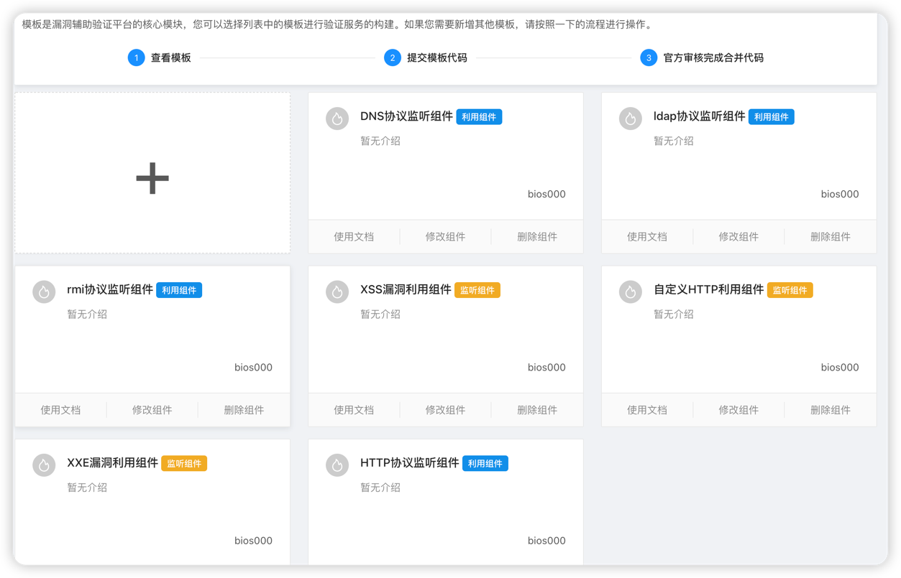
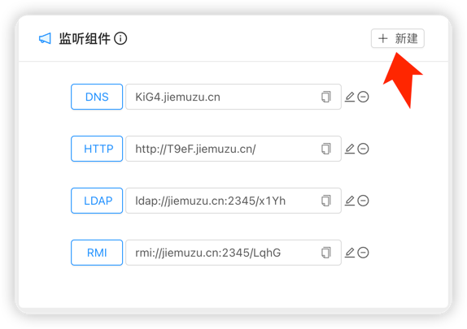
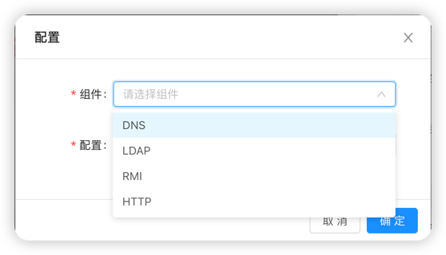
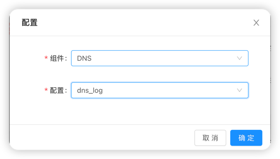
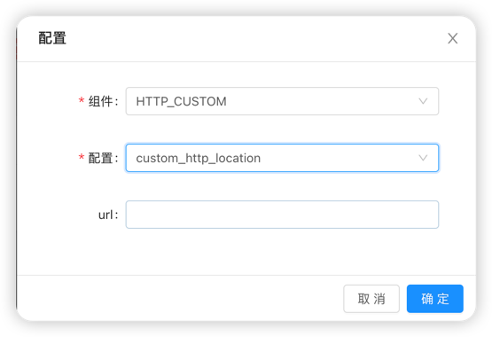

# Antenna的灵魂-组件(Template)
组件模块决定着你能通过Antenna实现多少有趣的事情，我们虽然想让你立刻去创建属于你的自定义组件，
但是还是需要让你了解组价模块的基本使用**本文阅读大概需要 10 minutes左右**.

## 监听组件与利用组件
我们按照系统功能将组件分为监听与利用两类,其中监听组件用于接收并识别各种协议请求,
他也决定着你的利用组件实例(链接)种类，Antenna初始支持**NDS/HTTP/RMI/LDAP**协议的接收与识别。

利用组件用于平台接收到各种协议请求后的处理逻辑，当我们遇到各种漏洞场景时，总是需要一个第三方用于接收目标
的请求并希望返回一些能够触发漏洞的响应内容。比如遇到XSS漏洞你希望返回的获取cookie的js资源，遇到XXE漏洞
你又希望遇到返回的是读取文件的xml资源。

## 如何创建一个组件实例(链接)
你已经了解了组件的基本信息，知道了组件想要实现他的作用，必须要创建组件实例、
抛弃系统初始创建的组件实例，让我们首先创建自己创建一个组件实例

### 创建监听组件实例
监听组件的创建是最简单的，因为他的作用只有监听并记录用户想让他记录的请求。
我们以创建DNS组件实例

首先点击初始任务，点击监听组件的**新建**

你会看到两个需要你选择的框，**组件框**是选择你想要创建的组件类型 ，
**配置框**是选择你需要用的组件下的功能。

我们点击**组件框**选择DNS

点击**配置框**选择dns_log

点击确定，你就获得了一个DNS组件实例

### 创建利用组件实例
利用组件的创建比监听组件要复杂一些，因为他有非常多的灵活配置，例如XSS组件
他支持多选配置，也就是说你的需求在**获取cookie(xss_get_cookie)**功能不能完全满足的时候还可以再加上
**获取源码(xss_get_page_source)**
如果一些组件的功能虽然给了你实现你想法的基础，但是还是需要你填写你特定的需求，比如**自定义http组件(HTTP_CUSTOM)**
,他可以让你指定你想要请求该实例的目标进行自定义响应，比如说你要跳转的地址(custom_http_location)，以及你希望它访问到的内容(custom_http_page)

关于这些组件的具体使用，你可以查看网站中关于这些组件的具体介绍及使用方法