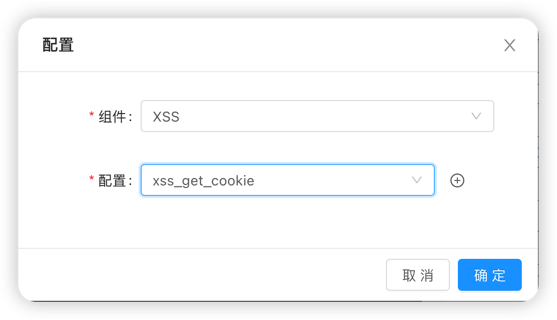

## XSS 组件使用教程

### XSS漏洞

关于XSS漏洞作者经常使用到便是利用漏洞读取用户cookie以及访问页面源码，所以根据这一功能作者提供
了我用到常见的几种场景**本文阅读大概需要 5 minutes左右**.

#### 获取用户cookie xss_get_cookie

该功能可以通过xss漏洞获取触发漏洞的用户cookie以及其余一些敏感信息
我们找到存在漏洞的目标地址

通过Antenna系统生成拥有获取cookie功能的组件实例，

将生成的组件实例，放入目标出发漏洞的参数值处(这里的xss需要修改payloa格式)

此时查看Antenna项目的消息,已经获取到触发漏洞的用户相关信息

#### 获取用户访问页面源码 xss_get_cookie

该功能可以通过xss漏洞获取触发漏洞的页面源码，用法与**xss_get_cookie**
相同

#### xss的多选项

xss利用组件与其他组件唯一不同的是，其功能可以多选，也就是说你可以让同一个组件
同时拥有获取用户敏感信息以及用户访问源码的能力(基础版本只提供这两个功能，你也可以自定义开发多个功能)

