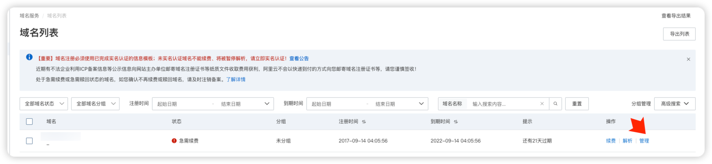
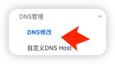
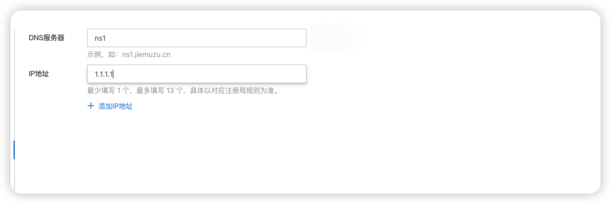
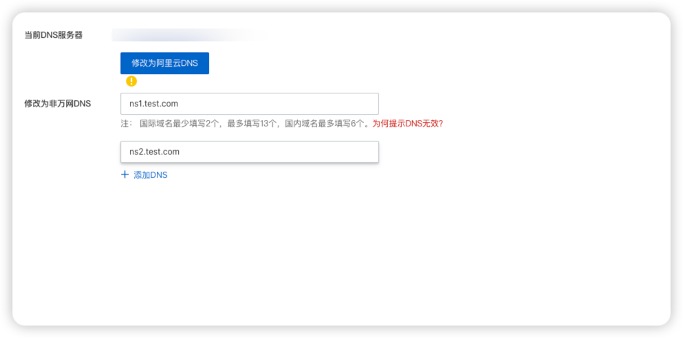
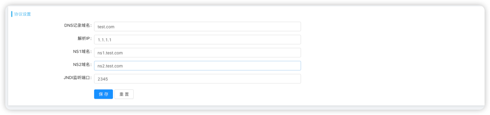
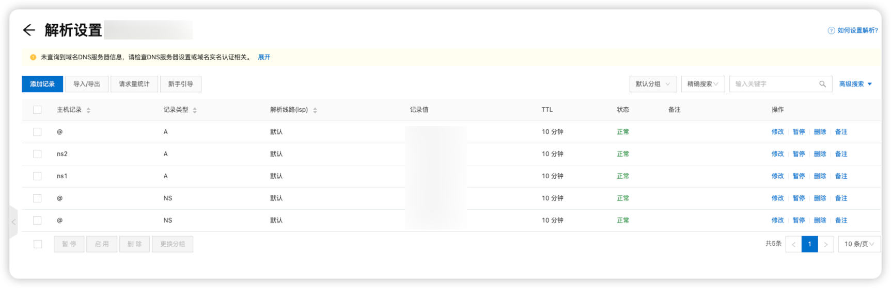

# 阿里云域名配置DNS

打开阿里云，首先购买域名(购买流程不过多叙述） 购买域名后进入阿里云控制台-域名-域名列表

这里已购买test.com，antenna系统所在服务器公网地址为1.1.1.1为例

点击操作栏中的管理

进入管理界面后点击左侧导航栏DNS管理-自定义DNS HOST

点击创建DNS服务器，然后创建ns1.test.com和ns2.test.com，其ip地址设置为antenna系统所在服务器公网地址

创建后点击同步再进入左侧导航栏DNS管理-DNS修改，点击修改DNS服务器按钮，将test.com的dns服务器修改为刚才设置的ns1.test.com与ns2.test.com

点击同步后回到Antenna系统保存协议相关设置

然后进入域名列表解析配置，进行配置ns1与ns2的A记录配置

注意！！！服务器防火墙需开启上述配置端口的进出规则，DNS默认使用53端口也需对外开放！！！
